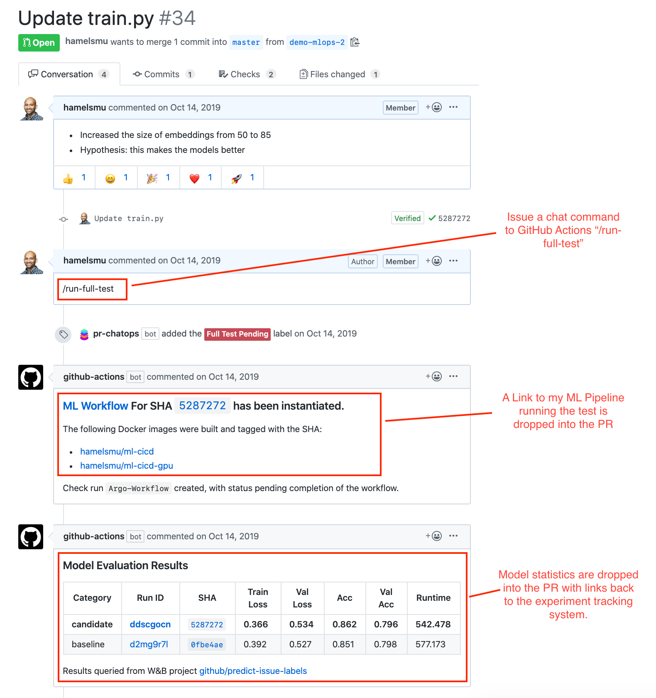
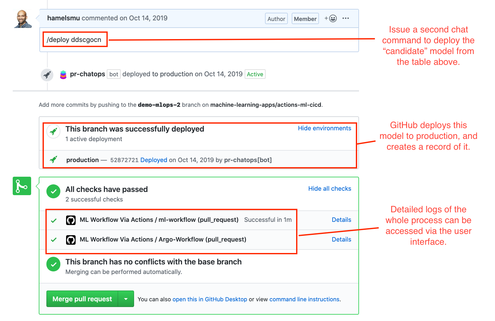

# What Superpowers?

Hi, I'm [Hamel Husain](https://twitter.com/HamelHusain).  I'm a machine learning engineer at GitHub.  Recently, GitHub released a new product called [GitHub Actions](https://github.com/features/actions), which has mostly flown under the radar in the machine learning and data science community as just another continuous integration tool.

Recently, I've been able to use GitHub Actions to build some very unique tools for Data Scientists, which I want to share with you today.  Most importantly, I hope to get you excited about GitHub Actions, and the promise it has for giving you new superpowers as a Data Scientist.  Here are two projects I recently built with Actions that show off its potential:

## fastpages

[fastpages](https://github.com/fastai/fastpages) is an automated, open-source blogging platform with enhanced support for Jupyter notebooks.  You save your notebooks, markdown, or Word docs into a directory on GitHub, and they automatically become blog posts.

## Machine Learning Ops

Wouldn't it be cool if you could invoke a chatbot natively on GitHub to test your machine learning models on the infrastructure of your choice (GPUs), log all the results, and give you a rich report back in a pull request so that everyone could see the results?  You can with GitHub Actions!

Consider the below annotated screenshot of [this Pull Request](https://github.com/machine-learning-apps/actions-ml-cicd/pull/34):




A more in-depth explanation about the above project can be viewed in [this video](https://youtu.be/Ll50l3fsoYs).

Using GitHub Actions for machine learning workflows is starting to catch on.  [Julien Chaumond](https://twitter.com/julien_c), CTO of [Hugging Face](https://huggingface.co/), says:

> GitHub Actions are great because they let us do CI on GPUs (as most of our users use the library on GPUs not on CPUs), on our own infra! [^1]

Additionally, you can host a GitHub Action for other people so others can use parts of your workflow without having to re-create your steps.  I provide examples of this below.

# A Gentle Introduction To GitHub Actions

## What Are GitHub Actions?

[GitHub Actions](https://github.com/features/actions) allow you to run arbitrary code in response to [events](https://help.github.com/en/actions/reference/events-that-trigger-workflows).  Events are activities that happen on GitHub such as:

- Opening a pull request
- Making an issue comment
- Labeling an issue
- Creating a new branch
- ... [and many more](https://help.github.com/en/actions/reference/events-that-trigger-workflows)

When an event is created, the GitHub Actions context is hydrated with a payload containing metadata for that event.  Below is an example of a payload that is received when an issue is created:

```json
{
  "action": "created",
  "issue": {
    "id": 444500041,
    "number": 1,
    "title": "Spelling error in the README file",
    "user": {
      "login": "Codertocat",
      "type": "User"
    },
    "labels": [
      {
        "id": 1362934389,
        "name": "bug"
      }
    ],
    "body": "It looks like you accidently spelled 'commit' with two 't's."
  }
}
```

This functionality allows you to respond to various events on GitHub in an automated way.

## Example: A fastpages Action Workflow

The best way to familiarize yourself with Actions is by studying examples.  Let's take a look at the Action workflow that automates the build of fastpages.

### Part 1: Define Workflow Triggers

The top of the YAML file looks like this:

```yaml
name: CI
on:
  push:
    branches:
      - master
  pull_request:
```

This means that this workflow is triggered on either a push or pull request event.

### Part 2: Define Jobs

Next, we define jobs:

```yaml
jobs:
  build-site:
    if: ( github.event.commits[0].message != 'Initial commit' ) || github.run_number > 1
    runs-on: ubuntu-latest
    steps:
```

### Part 3: Define Steps

Below are the first two steps in our workflow:

```yaml
   - name: Copy Repository Contents
     uses: actions/checkout@master
     with:
       persist-credentials: false

   - name: convert notebooks and word docs to posts
     uses: ./_action_files
```

The final step deploys the website:

```yaml
  - name: Deploy
    if: github.event_name == 'push'
    uses: peaceiris/actions-gh-pages@v3
    with:
      deploy_key: ${{ secrets.SSH_DEPLOY_KEY }}
      publish_dir: ./_site
```

# Conclusion

We hope that this has shed some light on how we use GitHub Actions to automate fastpages.

Still confused about how GitHub Actions could be used for Data Science?  Here are some ideas of things you can build:

- Jupyter Widgets that trigger GitHub Actions to perform various tasks on GitHub via the [repository dispatch event](https://help.github.com/en/actions/reference/events-that-trigger-workflows#external-events-repository_dispatch)
- Integration with [Pachyderm](https://www.pachyderm.com/) for data versioning.
- Integration with your favorite cloud machine learning services, such [Sagemaker](https://aws.amazon.com/sagemaker/), [Azure ML](https://azure.microsoft.com/en-us/free/machine-learning/) or GCP's [AI Platform](https://cloud.google.com/ai-platform).

## Related Materials

- GitHub Actions official [documentation](https://help.github.com/en/actions)
- [Hello world Docker Action](https://github.com/actions/hello-world-docker-action)
- [Awesome Actions](https://github.com/sdras/awesome-actions): A curated list of interesting GitHub Actions by topic.

### Getting In Touch

- Hamel Husain [@HamelHusain](https://twitter.com/HamelHusain)
- Jeremy Howard [@jeremyphoward](https://twitter.com/jeremyphoward)

[^1]: You can see some of Hugging Face's Actions workflows for machine learning [on GitHub](https://github.com/huggingface/transformers/tree/master/.github/workflows)
